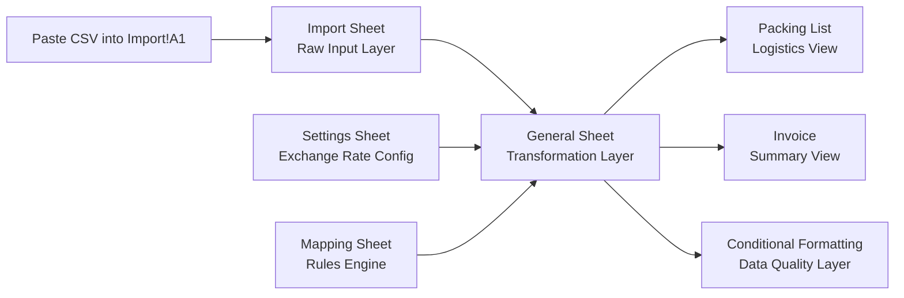

# Architecture Design

## 1 System Overview

This workbook is designed as a layered data model inside Google Sheets.

It transforms raw Shopify CSV exports into structured logistics and invoice-ready outputs using only formulas and rule-based configuration.

The architecture follows a strict separation of responsibilities:

- Input layer
- Configuration layer
- Transformation layer
- Output layer
- Validation layer

Only one user action is allowed:

> Paste CSV into `Import!A1`

Everything else updates automatically.

## 2 Data Flow Diagram

## 3 Layered Architecture

### 3.1 Input Layer

#### Sheet: `Import`

Purpose:

- Receives raw Shopify CSV export
- Single entry point
- No helper columns
- No transformations
- No manual edits after paste

Design Principle:

Import must remain clean and untouched.
 All transformations happen downstream.

### 3.2 Configuration Layer

Sheets:

- `Settings`
- `Mapping`

#### Settings

- `B1` stores USD → EUR exchange rate
- Changing this value automatically updates all EUR calculations

This enables business flexibility without editing formulas.

#### Mapping

Mapping acts as a rule engine.

Columns:

- Pattern
- Match Field (SKU or Name)
- Category (Greenhouse or Accessory)

Responsibilities:

- Classify each line item
- Prevent hardcoded logic in formulas
- Allow rule updates without modifying core structure

Design Principle:

Mapping is the single source of truth for product classification.

### 3.3 Transformation Layer

#### Sheet: `General`

This is the core data model.

Responsibilities:

- Extract required fields from Import using header-based lookup
- Standardize structure regardless of column order
- Combine address fields
- Apply Mapping-based classification
- Extract greenhouse length from product name
- Compute:
  - Price EUR
  - Total EUR
  - Base / Extension derivation inputs
- Provide structured dataset for output layers

Important:

General operates at line-item level,
 because Shopify exports are line-item based.

This ensures:

- Multiple products per order handled correctly
- Accurate accessory counting
- Accurate invoice summary

### 3.4 Output Layer

Two output sheets:

#### Packing List

Purpose:

Logistics-ready view of shipment data.

Derived from:

General sheet

Includes:

- Order Nr
- Address
- Ordered Greenhouse
- SKU
- Pallet Size
- Pallet Weight
- Packages

Additional features:

- Automatic total weight calculation
- Automatic total package count
- Filter enabled
- Header frozen

#### Invoice

Purpose:

Finance-ready summary grouped by unique greenhouse type.

Derived from:

General sheet

Responsibilities:

- Group by unique Ordered Greenhouse
- Calculate:
  - Count of Bases
  - Count of Extensions
  - Amount of Accessories
- Include total row at bottom

No pivot tables are used.

Aggregation is achieved via:

- UNIQUE
- COUNTIFS / SUMIFS

### 3.5 Validation Layer

Validation is implemented via conditional formatting rules.

Two primary validation cases:

1. Missing pallet data
   - Pallet Size empty
   - Pallet Weight empty
   - Packages empty
2. Unmatched Mapping rule
   - Product not classified as Greenhouse or Accessory

Design Goal:

Errors must be visible immediately after CSV paste.

## 4 Key Design Decisions

### 4.1 Header-Based Extraction

Because CSV column order may change:

All column references must use header lookup.

No hardcoded column letters allowed.

### 4.2 Rule-Driven Classification

Accessory detection must not depend on:

- Price
- FREE GIFT keyword
- Hardcoded conditions

Only Mapping sheet determines classification.

### 4.3 Line-Item Granularity

Shopify exports duplicate order information per line item.

Therefore:

System must operate at line-item level,
 not order header level.

### 4.4 Single Source of Truth Principle

- Exchange Rate → Settings
- Classification Rules → Mapping
- Raw Data → Import
- All Calculations → General

No logic duplication across sheets.

## 5 Update Mechanism

After user pastes new CSV into Import!A1:

- General recalculates automatically
- Packing List updates automatically
- Invoice updates automatically
- Totals update automatically
- Validation highlights update automatically

No manual refresh required.

## 6 Architectural Summary

This workbook is designed as a structured, rule-driven spreadsheet data model.

It separates:

- Data input
- Business rules
- Transformations
- Presentation
- Validation

This ensures:

- Robustness to CSV structure changes
- Maintainability
- Zero manual workflow
- Clear responsibility boundaries

## 6 Sheet Column Definitions

This section defines the exact column structure of each sheet before formula implementation.

It serves as the structural blueprint of the data model.

### 6.1 Import Sheet

Purpose:

Raw Shopify CSV input.

Rules:

- CSV must be pasted into `A1`
- No helper columns allowed
- No transformations inside this sheet
- All references must be header-based in downstream sheets

### 6.2 Settings Sheet

| Cell | Purpose                 |
| ---- | ----------------------- |
| B1   | USD → EUR Exchange Rate |

Example:

| A                         | B    |
| ------------------------- | ---- |
| Exchange Rate (USD → EUR) | 0.92 |

### 6.3 Mapping Sheet

Columns:

| Column | Name        | Description              |
| ------ | ----------- | ------------------------ |
| A      | Pattern     | Keyword or regex pattern |
| B      | Match Field | SKU or Name              |
| C      | Category    | Greenhouse or Accessory  |

Notes:

- Pattern matching supports regex
- Rules evaluated top-down
- No hardcoded classification logic allowed elsewhere

### 6.4 General Sheet (Core Data Model)

All rows represent line-items from Import.

#### Column Structure

| Column | Field Name            | Source                    | Type      | Description               |
| ------ | --------------------- | ------------------------- | --------- | ------------------------- |
| A      | Order Nr              | Import: Name              | Direct    | Order identifier          |
| B      | Address               | Shipping fields           | Derived   | Combined shipping address |
| C      | Product Name          | Import: Lineitem name     | Direct    | Original product name     |
| D      | SKU                   | Import: Lineitem sku      | Direct    | Product SKU               |
| E      | Category              | Mapping                   | Derived   | Greenhouse / Accessory    |
| F      | Greenhouse Length (m) | Product Name              | Derived   | Extracted numeric length  |
| G      | Qty                   | Import: Lineitem quantity | Direct    | Quantity                  |
| H      | Pallet Size (mm)      | Manual / Future           | Manual    | Logistics data            |
| I      | Pallet Weight (kg)    | Manual / Future           | Manual    | Logistics data            |
| J      | Packages              | Manual / Future           | Manual    | Logistics data            |
| K      | Price USD             | Import: Lineitem price    | Direct    | Unit price in USD         |
| L      | Exchange Rate         | Settings!B1               | Reference | USD → EUR rate            |
| M      | Price EUR             | Calculated                | Derived   | Price USD × Exchange Rate |
| N      | Total EUR             | Calculated                | Derived   | Qty × Price EUR           |

#### Design Notes

- All Import fields must use header-based lookup
- Address is constructed from:
  - Shipping Name
  - Shipping Street / Address1
  - Shipping City
  - Shipping Province
  - Shipping Zip
  - Shipping Country
- Greenhouse Length extracted via regex from Product Name
- Category determined exclusively via Mapping sheet

### 6.5 Packing List Sheet

Derived from General.

#### Column Structure

| Column | Field Name         |
| ------ | ------------------ |
| A      | Order Nr           |
| B      | Address            |
| C      | Product Name       |
| D      | SKU                |
| E      | Pallet Size (mm)   |
| F      | Pallet Weight (kg) |
| G      | Packages           |

Additional Features:

- Automatic total weight calculation
- Automatic total package calculation
- Header frozen
- Filter enabled

### 6.6 Invoice Sheet

Aggregated summary based on General.

#### Column Structure

| Column | Field Name            | Description               |
| ------ | --------------------- | ------------------------- |
| A      | Ordered Greenhouse    | Unique greenhouse product |
| B      | Total Qty             | Total ordered quantity    |
| C      | Count of Bases        | Qty                       |
| D      | Count of Extensions   | ((Length - 4) / 2) × Qty  |
| E      | Amount of Accessories | Count of accessory items  |

Rules:

- No pivot tables
- Use UNIQUE + aggregation functions
- Include total row at bottom